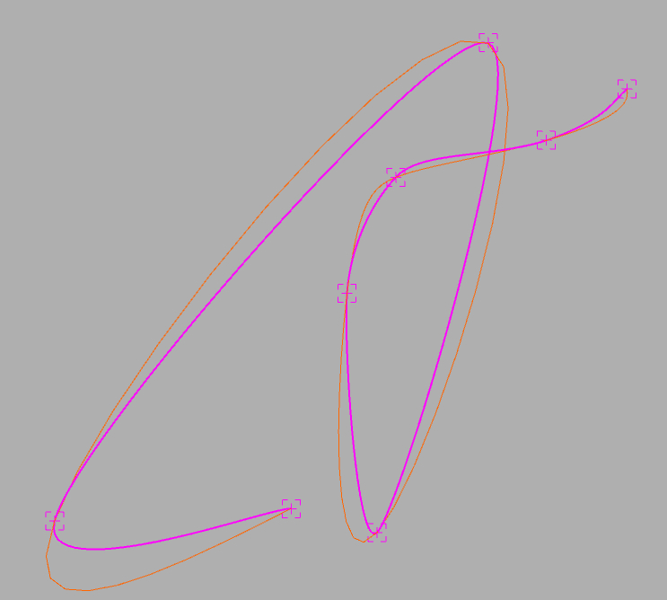
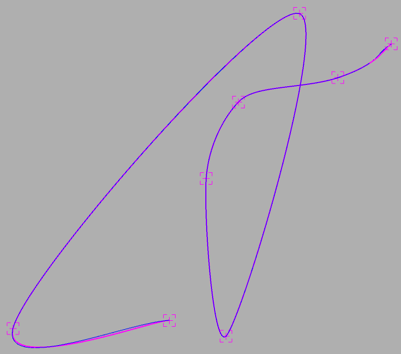
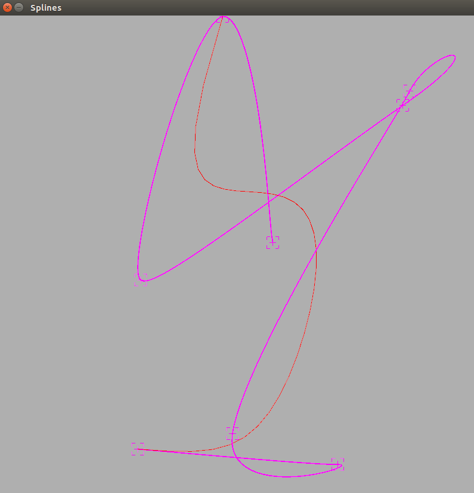
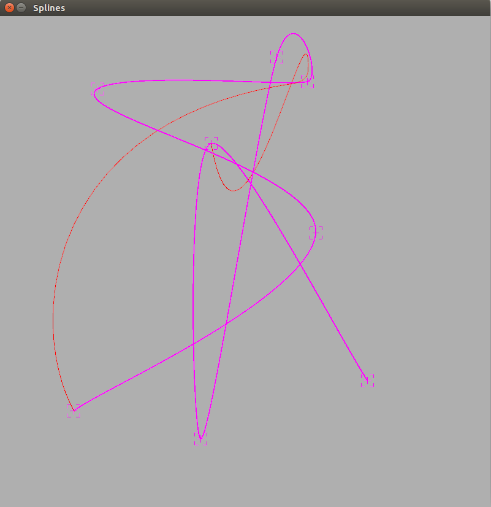
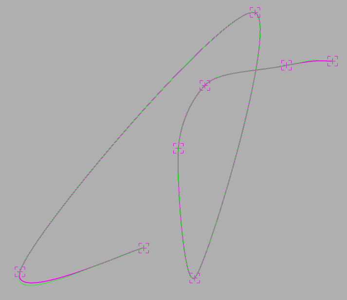

# Taller de splines

## Propósito

Estudiar algunos tipos de curvas paramétricas y sus propiedades.

## Tarea

Implemente las curvas cúbicas naturales, de Hermite y Bezier (cúbica y de grado 7), de acuerdo a las indicaciones del sketch adjunto.

*Sugerencia:* Como las curvas de Hermite y cúbica de Bezier requieren varias secciones, reacomode los puntos de control para que su continuidad sea C1. Ver [acá](https://visualcomputing.github.io/Curves/#/5/5) y [propiedad 4 de acá](https://visualcomputing.github.io/Curves/#/6/4).

## Discusión
Se realiza la implementación de interpolación para curvas cúbicas naturales, Hermite, Bezier cúbica y grado 7, y finalmente, se realiza la implementación del algoritmo de Catmull Rom.

Las siguientes imágenes muestran las diferentes representaciones:

## Profundización

Represente los _boids_ del [FlockOfBoids](https://github.com/VisualComputing/framesjs/tree/processing/examples/Advanced/FlockOfBoids) mediante superficies de spline.

## Integrantes

Máximo 3.

Complete la tabla:

|       Integrante         | github nick                                              |
|--------------------------|----------------------------------------------------------|
| Diego Andrés Baquero     | [diegobaqt](https://github.com/diegobaqt)                |
| Andrés Felipe López      | [andreslopzi](https://github.com/andreslopzi)            |

## Referencias

[1] https://en.wikipedia.org/wiki/Cubic_Hermite_spline

[2] https://people.sc.fsu.edu/~jburkardt/cpp_src/hermite_cubic/hermite_cubic.html

[3] http://mathworld.wolfram.com/CubicSpline.html

[4] http://graphics.cs.ucdavis.edu/~joy/ecs278/notes/Catmull-Rom-Spline.pdf

## Entrega

* Modo de entrega: Haga [fork](https://help.github.com/articles/fork-a-repo/) de la plantilla e informe la url del repo en la hoja *urls* de la plantilla compartida (una sola vez por grupo). Plazo: 29/4/18 a las 24h.
